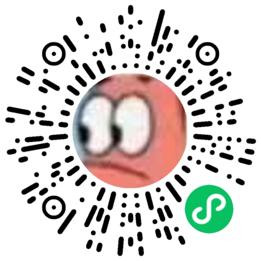

小红书：慢手（ID：49624205605）。
网站：https://view.oraen.com/


# Oraen View
一个基于 Gabor 刺激、视觉知觉学习和自适应阈值测量的浏览器研究原型。

## 官方小程序



使用微信扫码打开“开源视觉”官方小程序，快速开始训练。

当前包含六个页面：

- **视觉训练**：单图、三图、清晰图、移图和综合训练；使用独立的 2-down/1-up 自适应难度，并跨已完成的训练继承各模式阈值。每次刺激会从 0°、45°、90°、135° 中独立随机选择方向，刺激出现时四边红框同步闪烁，连续三次判断错误时会提醒重新注视中心。
- **掌上训练**：适配触屏，点选模式后直接开始训练；单项 64 次，综合训练四项各 64 次，共 256 次。使用下方“左键 / 右键”作答，记录与难度完全独立于电脑版。
- **视觉测试**：八方向 Landolt C 大小、深浅、拥挤大小和拥挤深浅测试；依次完成左眼、右眼和双眼，连续两次正确或连续两次错误后才调整难度，并随反转逐渐缩小步长。拥挤项目会先测单 C 基线，再测 5×5 矩阵中心 C。
- **训练数据**：从 IndexedDB 读取训练和视觉测试记录，提供训练难度曲线、四类视觉测试趋势图及 JSON 导出。
- **使用指引**：四种训练的图示和鼠标操作，以及训练距离、环境和佩戴眼镜的提示。
- **关于项目**：作者经历、免费使用与禁止商用说明、训练效果说明，以及项目地址和联系方式。

## 启动

```bash
npm start
```

浏览器访问 `http://127.0.0.1:4173`。首页会按设备类型选择入口：电脑进入 `#/training`，手机和平板进入 `#/mobile`。每次进入“训练数据”时，默认选中对应设备的标签，也可以手动切换。直接打开指定页面的链接不受影响。

电脑版点击开始后页面会先进入全屏预备模式并隐藏菜单，再按一次鼠标左键才正式开始计时和出题；训练完成后自动恢复，按 `Esc` 会结束当前训练并退出全屏。

## 网站构建与发布

运行 `npm run build`，网站文件会生成到 `dist/public`。构建只复制 `public`，并排除其中名为 `xhs` 的目录；根目录的 `xhs` 小红书小工具目录不会进入网站产物。

服务器发布时只打包 `dist` 内的 `public` 目录，不上传整个项目。`dist` 是可重新生成的构建目录，每次构建都会清空；`xhs` 可正常纳入 Git 管理。

## 数据结构

电脑版 IndexedDB 数据库名为 `oraenViewDB`，首次运行会自动迁移旧版本的本地记录。数据库包含：

- `sessions`：会话配置、状态、起止时间、汇总成绩和各模式最终阈值。
- `trials`：每次刺激参数、正确答案、用户答案、反应时间和自适应前后难度。
- `settings`：保存跨训练自适应阈值，并为后续屏幕校准和训练偏好预留。
- `visionTests`：视觉测试项目、眼别顺序、各阶段阈值和拥挤损失。
- `visionTestTrials`：每题方向、答案、反应时间、阶梯水平和反转次数。

训练会话按每页 20 条展示，本地最多保留最近 100 个会话；超过上限时会连同最早会话的试次明细一起清理。

掌上训练使用独立的 `oraenViewMobileDB` 数据库（`sessions`、`trials`、`settings`），不会迁移或继承电脑版记录。两端分别保留最近 100 场训练。数据页切换“电脑版 / 掌上训练”可分别查看曲线、导出或清空当前一端的数据与难度。手机训练中切到后台、改变训练画面尺寸或离开页面，会结束当前训练；未完成的训练不继承难度。

## 开发检查

安装开发依赖后运行 `npm test`，检查语法、使用协议和两端数据隔离。运行 `npm run test:mobile` 使用本机 Chrome 验证触屏训练、曲线和中断流程（测试中缩短了刺激等待时间）。

## 说明

本项目目前是训练机制与产品交互原型，不是医疗器械，也不用于诊断或替代专业治疗。大小结果使用浏览器 CSS px；在完成屏幕物理尺寸、亮度和观看距离校准前，不能直接换算成标准视力或 logMAR。

## 首次使用确认

首次打开网站，会在原主页上弹出简短的使用协议；阅读并主动勾选同意后即可继续使用。确认版本和时间保存在当前浏览器的 localStorage 中；清理网站数据或协议版本更新后会重新提示。不同意则不启动训练、测试或数据初始化。可在“关于项目”中再次查看协议。浏览器不允许保存时，确认仅对本次页面有效。

<!-- ABOUT_PROJECT_START -->
## 关于项目

项目起源于一个在互联网公司工作的普通程序员，他一直以来也受到弱视的困扰。对他来说，事物的纹理和细节总是不容易看清，也经常认不清人脸。看电视时，他常常只能靠发型区分人物，有时甚至分不清一个人长得好不好看。这些是他日常生活里很具体的烦恼，也是他一直想把视力改善一点的原因。

在发现市场上治疗弱视的软件都需要上万块钱之后，为了治疗弱视，他决定...

联系作者： [oraen1998@gmail.com](mailto:oraen1998@gmail.com)，小红书：慢手（ID：49624205605）。

<!-- ABOUT_PROJECT_END -->

## 重要参考文献

1. Campbell 等，1978，British Journal of Ophthalmology。[Preliminary results of a physiologically based treatment of amblyopia.](https://doi.org/10.1136/bjo.62.11.748)

2. Ciuffreda 等，1980，British Journal of Ophthalmology。[Lack of positive results of a physiologically based treatment of amblyopia.](https://doi.org/10.1136/bjo.64.8.607)

3. Yeh 等，2021，Scientific Reports。[Portable rotating grating stimulation for anisometropic amblyopia with 6 months training](https://doi.org/10.1038/s41598-021-90936-7)

4. Khorrami-Nejad 等，2024，Strabismus。[Comparison of Cambridge vision stimulator (CAM) therapy with passive occlusion therapy in the management of unilateral amblyopia; a randomized clinical trial](https://doi.org/10.1080/09273972.2024.2353153)

5. Bodur 等，2026（2025 年在线发表），Strabismus。[Evaluation of the effectiveness of Cambridge Visual Stimulator treatment in amblyopia patients: a retrospective study](https://doi.org/10.1080/09273972.2025.2579178)

6. Polat 等，2004，PNAS。[Improving vision in adult amblyopia by perceptual learning](https://doi.org/10.1073/pnas.0401200101)

7. Levi 与 Li，2009，Vision Research。[Perceptual learning as a potential treatment for amblyopia: a mini-review.](https://doi.org/10.1016/j.visres.2009.02.010)

8. Huang 等，2009，Journal of Vision。[Mechanisms underlying perceptual learning of contrast detection in adults with anisometropic amblyopia](https://doi.org/10.1167/9.11.24)

9. Li 与 Levi，2004，Journal of Vision。[Characterizing the mechanisms of improvement for position discrimination in adult amblyopia](https://doi.org/10.1167/4.6.7)

10. Sanayei 等，2018，Nature Communications。[Perceptual learning of fine contrast discrimination changes neuronal tuning and population coding in macaque V4](https://doi.org/10.1038/s41467-018-06698-w)

11. Zhou 等，2024，Translational Vision Science & Technology。[Perceptual Learning Based on the Lateral Masking Paradigm in Anisometropic Amblyopia With or Without a Patching History](https://doi.org/10.1167/tvst.13.1.16)

12. Li RW 等，2011，PLOS Biology。[Video-game play induces plasticity in the visual system of adults with amblyopia.](https://doi.org/10.1371/journal.pbio.1001135)

13. Li J 等，2013，Current Biology。[Dichoptic training enables the adult amblyopic brain to learn](https://doi.org/10.1016/j.cub.2013.01.059)

14. Vedamurthy 等，2015，Scientific Reports。[Mechanisms of recovery of visual function in adult amblyopia through a tailored action video game](https://doi.org/10.1038/srep08482)

15. Levi、Knill 与 Bavelier，2015，Vision Research。[Stereopsis and amblyopia: A mini-review.](https://doi.org/10.1016/j.visres.2015.01.002)

16. Li SL 等，2015，Journal of AAPOS。[Dichoptic movie viewing treats childhood amblyopia.](https://doi.org/10.1016/j.jaapos.2015.08.003)

17. Holmes 等，2016，JAMA Ophthalmology。[Effect of a Binocular iPad Game vs Part-time Patching in Children Aged 5 to 12 Years With Amblyopia](https://doi.org/10.1001/jamaophthalmol.2016.4262)

18. Gao 等，2018，JAMA Ophthalmology。[Effectiveness of a Binocular Video Game vs Placebo Video Game for Improving Visual Functions in Older Children, Teenagers, and Adults With Amblyopia](https://doi.org/10.1001/jamaophthalmol.2017.6090)

19. Scheiman 等，2005，Archives of Ophthalmology。[Randomized trial of treatment of amblyopia in children aged 7 to 17 years.](https://doi.org/10.1001/archopht.123.4.437)

20. Levi，2020，Vision Research。[Rethinking amblyopia 2020.](https://doi.org/10.1016/j.visres.2020.07.014)
